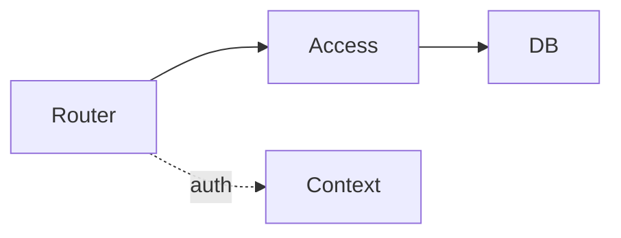
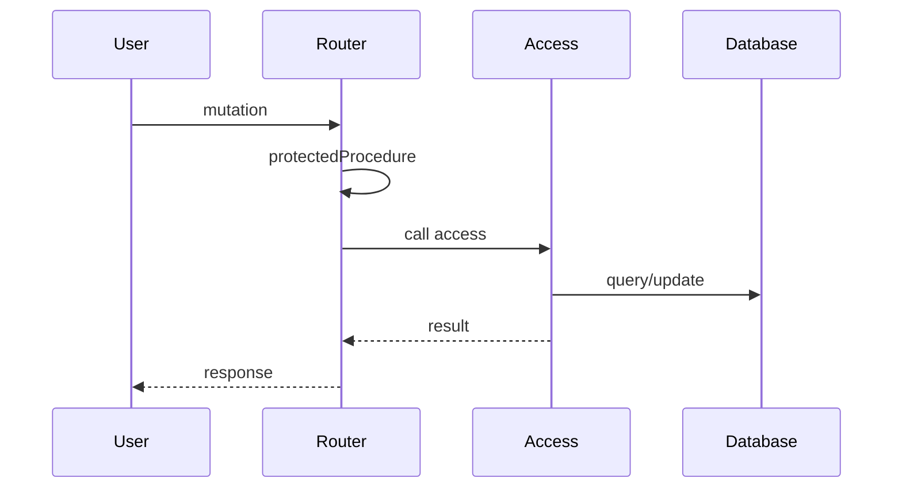

<style>
.lab-badge {
    display: inline-block;
    padding: 4px 10px;
    border-radius: 999px;
    background: #eef2ff;
    color: #3730a3;
    font-weight: 600;
    font-size: 0.9em;
}
.mermaid-fit {
  transform: scale(0.7);
  transform-origin: top center;
}
</style>

# Better Auth в Next.js

### Лекция 2  
Авторизация, RBAC и защита API

---

# Цель лекции

Понять, как построить корректную модель авторизации  
в архитектуре Next.js + tRPC  
с сохранением DI и слоистой структуры.

---

# Аутентификация ≠ Авторизация

Аутентификация:

- кто пользователь?

Авторизация:

- что ему разрешено?

---

# Пользователь авторизован

Но это не означает:

- что он ADMIN
- что он владелец ресурса
- что он имеет право изменять данные

---

# Пример проблемы

Пользователь:

- вошёл в систему
- вызывает deletePost(id)

Вопрос:

- это его пост?

---

# Архитектурная задача

Нужно обеспечить:

- централизованную проверку авторизации
- корректную семантику ошибок
- сохранение DI

---

# Краткий рефреш tRPC

tRPC предоставляет:

- procedure
- middleware
- context
- TRPCError

---

# protectedProcedure (идея)

protectedProcedure:

- проверяет наличие user
- используется вместо базовой procedure
- централизует проверку

---

# protectedProcedure

<span class="lab-badge">🧪 bauth11</span>

```ts
export const protectedProcedure = t.procedure.use(
  async ({ ctx, next }) => {
    if (!ctx.user) {
      throw new TRPCError({ code: "UNAUTHORIZED" })
    }

    return next()
  }
)
```

---

# Что делает protectedProcedure

- гарантирует наличие пользователя
- устраняет дублирование проверок
- формирует архитектурный паттерн

---

# currentUser query

<span class="lab-badge">🧪 bauth12</span>

Получение текущего пользователя через context.

```ts
export const currentUser = protectedProcedure.query(
  ({ ctx }) => {
    return ctx.user
  }
)
```

---

# Важный принцип

Router:

- не импортирует auth
- не вызывает getSession
- использует только ctx.user

---

# Роль в модели пользователя

<span class="lab-badge">🧪 bauth13</span>

Модель user расширяется полем role.

RBAC требует:

- role в таблице
- централизованной проверки

---

# Что такое RBAC

Role-Based Access Control:

- USER
- ADMIN

Роль определяет набор допустимых операций.

---

# adminProcedure

<span class="lab-badge">🧪 bauth14</span>

```ts
export const adminProcedure = protectedProcedure.use(
  async ({ ctx, next }) => {
    if (ctx.user.role !== "ADMIN") {
      throw new TRPCError({ code: "FORBIDDEN" })
    }

    return next()
  }
)
```

---

# ADMIN-only mutation

<span class="lab-badge">🧪 bauth15</span>

```ts
export const deleteUser = adminProcedure.mutation(
  async ({ input }) => {
    return deleteUserById(input.id)
  }
)
```

---

# Что мы получили

- централизованный RBAC
- декларативную защиту
- отсутствие дублирования

---

# Роль ≠ Владение ресурсом

Пользователь может быть USER:

- но владеть конкретным ресурсом

RBAC не решает ownership.

---

# Ownership check в router

<span class="lab-badge">🧪 bauth16</span>

```ts
export const updatePost = protectedProcedure.mutation(
  async ({ ctx, input }) => {
    if (ctx.user.id !== input.ownerId) {
      throw new TRPCError({ code: "FORBIDDEN" })
    }

    return updatePostInDb(input)
  }
)
```

---

# Проблема этого подхода

Router:

- начинает содержать бизнес-логику
- знает детали доменной модели
- становится «толстым»

---

# Ownership в access layer

<span class="lab-badge">🧪 bauth17</span>

```ts
export async function updatePost(userId, input) {
  const post = await findPost(input.id)

  if (post.ownerId !== userId) {
    throw new ForbiddenError()
  }

  return updatePostInDb(input)
}
```

---

# Архитектурное разделение



Router:

- проверяет наличие user

Access layer:

- проверяет инварианты

---

# UNAUTHORIZED vs FORBIDDEN

<span class="lab-badge">🧪 bauth18</span>

UNAUTHORIZED:

- нет пользователя

FORBIDDEN:

- пользователь есть
- прав недостаточно

---

# Пример различия

```ts
if (!ctx.user) {
  throw new TRPCError({ code: "UNAUTHORIZED" })
}

if (ctx.user.role !== "ADMIN") {
  throw new TRPCError({ code: "FORBIDDEN" })
}
```

---

# DI-гарантии

<span class="lab-badge">🧪 bauth19</span>

Router:

- получает user через context
- не импортирует auth
- не вызывает getSession напрямую

DI — архитектурный инвариант.

---

# Типичные ошибки RBAC

- Проверка роли в UI
- Дублирование проверки в каждой процедуре
- Проверка ownership только в router
- Смешивание бизнес-логики и авторизации

---

# Полный защищённый mutation-flow

<span class="lab-badge">🧪 bauth20</span>
<div class="mermaid-fit">



</div>

---

# Что мы построили

- protectedProcedure
- RBAC
- ownership
- двойную защиту
- корректную семантику ошибок

---

# Главный архитектурный инвариант

Router:

- тонкий
- декларативный

Access layer:

- содержит бизнес-инварианты

---

# Что должно быть понятно

Вы должны понимать:

- разницу между аутентификацией и авторизацией
- роль protectedProcedure
- модель RBAC
- проверку ownership
- двойную защиту
- семантику ошибок доступа

---

# Summary

Авторизация:

- строится поверх аутентификации
- централизуется через protectedProcedure
- расширяется через RBAC
- уточняется через ownership
- реализуется с соблюдением DI
