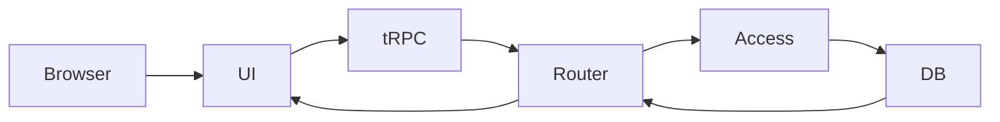
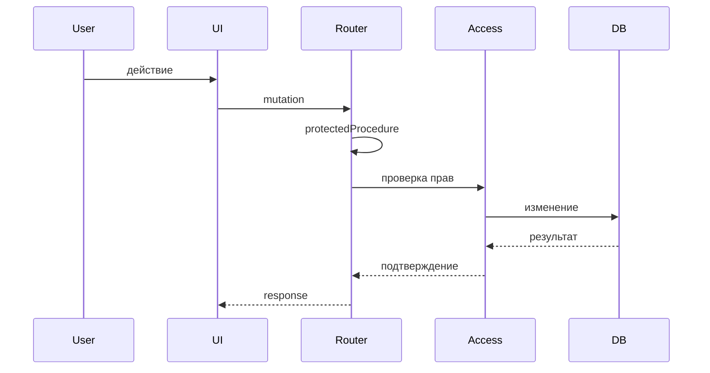

<style>
.lab-badge {
    display: inline-block;
    padding: 4px 10px;
    border-radius: 999px;
    background: #eef2ff;
    color: #3730a3;
    font-weight: 600;
    font-size: 0.9em;
}
.mermaid-fit {
  transform: scale(0.7);
  transform-origin: top center;
}
</style>

# Better Auth в Next.js

### Лекция 4  
Client integration и полный защищённый data-flow

---

# Цель лекции

Собрать все уровни защиты  
в единую production-ready модель  
защищённого fullstack-приложения.

---

# Архитектура к этому моменту

У нас уже есть:

- session
- protectedProcedure
- RBAC
- ownership
- middleware security

Теперь добавляем клиентский слой.

---

# Fullstack data-flow



---

# Источник истины

Server:

- проверяет session
- проверяет роль
- проверяет ownership

UI:

- улучшает UX
- не гарантирует безопасность

---

# currentUser на клиенте

<span class="lab-badge">🧪 bauth31</span>

Клиент получает текущего пользователя.

```ts
const { data: user } =
  trpc.auth.currentUser.useQuery()
```

---

# Что важно

- user приходит с сервера
- UI не определяет роль самостоятельно
- состояние синхронизировано с backend

---

# SSR (Server-Side Rendering) и currentUser

- Запрос выполняется на сервере  
- Cookie автоматически участвуют в запросе  
- currentUser определяется до отправки HTML  
- Клиент получает уже согласованное состояние  

Hydration синхронизирует результат на клиенте.

---

# UI Guard-компонент

<span class="lab-badge">🧪 bauth32</span>

```tsx
if (!user) {
  return <LoginPrompt />
}

return <ProtectedContent />
```

---

# UI Guard — это

- защита UX
- блокировка интерфейса
- не замена server-проверки

---

# Layout-level redirect

<span class="lab-badge">🧪 bauth33</span>

```ts
if (!user) {
  redirect("/login")
}
```

---

# Redirect выполняется

- на сервере
- до рендера страницы
- через App Router

---

# Role-based UI rendering

<span class="lab-badge">🧪 bauth34</span>

```tsx
{user?.role === "ADMIN" && (
  <AdminPanel />
)}
```

---

# Важный инвариант

Скрытая кнопка ≠ защищённая операция.

Server всё равно обязан проверить роль.

---

# Защищённая client mutation

<span class="lab-badge">🧪 bauth35</span>

```ts
const mutation = trpc.post.delete.useMutation({
  onSuccess: () => utils.post.list.invalidate(),
})
```

---

# Сквозной сценарий

1. UI вызывает mutation  
2. Router выполняет protectedProcedure  
3. Access-layer проверяет ownership  
4. DB обновляется  
5. invalidate обновляет UI  

---

# Обработка ошибок доступа

<span class="lab-badge">🧪 bauth36</span>

```ts
if (error?.data?.code === "UNAUTHORIZED") {
  redirect("/login")
}

if (error?.data?.code === "FORBIDDEN") {
  showMessage("Недостаточно прав")
}
```

---

# Разделение ответственности

UNAUTHORIZED:

- нет session

FORBIDDEN:

- прав недостаточно

UI корректно реагирует,  
но решение принимает сервер.

---

# Повторная проверка в access-layer

<span class="lab-badge">🧪 bauth37</span>

```ts
if (post.ownerId !== userId) {
  throw new ForbiddenError()
}
```

---

# Почему это критично

Даже если:

- UI скрыл кнопку
- Router проверил роль

Access-layer остаётся финальной защитой.

---

# Анти-паттерн: проверка роли только в UI

<span class="lab-badge">🧪 bauth38</span>

Проблема:

- пользователь может вызвать API напрямую
- UI-защита легко обходится

---

# Анти-паттерн: бизнес-логика в router

<span class="lab-badge">🧪 bauth39</span>

Router:

- не должен знать детали домена
- не должен проверять ownership
- должен оставаться декларативным

---

# Полный защищённый data-flow

<span class="lab-badge">🧪 bauth40</span>
<div class="mermaid-fit">

</div>
---

# Инварианты архитектуры

1. Session проверяется централизованно  
2. RBAC декларативен  
3. Ownership проверяется в access-layer  
4. UI не источник истины  
5. Ошибки имеют корректную семантику  

---

# Production-ready модель

- Cookie защищены  
- Session контролируется  
- RBAC централизован  
- Ownership гарантирован  
- Middleware изолирован  
- UI согласован с сервером  

---

# Итог курса

Мы построили:

- инфраструктуру session  
- модель авторизации  
- production security  
- целостный fullstack data-flow  

---

# Что должно быть понятно

Вы должны понимать:

- где живёт безопасность  
- как разделяются уровни ответственности  
- почему server — источник истины  
- как построить защищённое fullstack-приложение  

---

# Summary

Client integration:

- улучшает UX  
- не заменяет безопасность  

Полная защита:

- строится на сервере  
- централизуется  
- поддерживается архитектурно  
- масштабируется  

Курс завершён.
```
