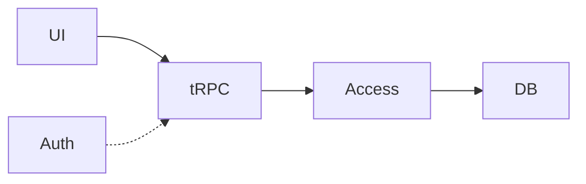
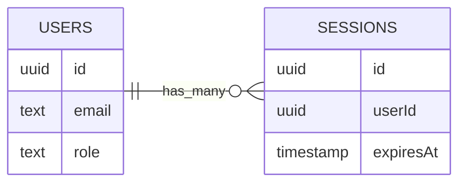
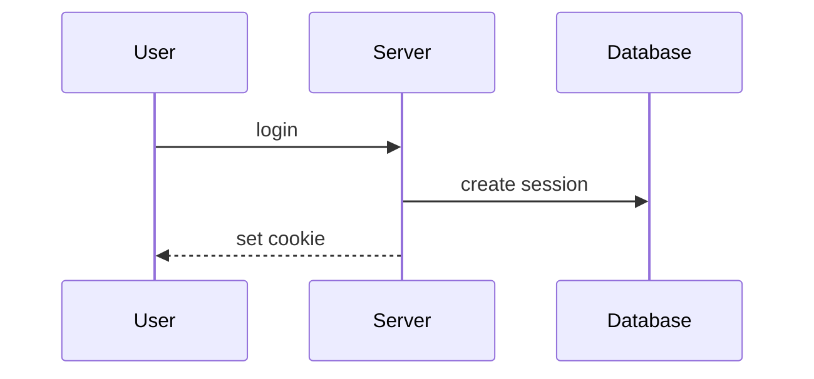

<style>
.lab-badge {
    display: inline-block;
    padding: 4px 10px;
    border-radius: 999px;
    background: #eef2ff;
    color: #3730a3;
    font-weight: 600;
    font-size: 0.9em;
}
.mermaid-fit {
  transform: scale(0.7);
  transform-origin: top center;
}
</style>

# Better Auth в Next.js 

### Лекция 1   
Аутентификация как инфраструктурный слой

---

# Цель лекции

Понять архитектурное место аутентификации  
и встроить Better Auth  
в существующую fullstack-архитектуру  
на основе PostgreSQL, Drizzle и tRPC.

---

# Почему auth — это не форма логина

Login — это UI.

Auth — это:

- идентификация
- управление сессией
- проверка доступа
- защита от атак

---

# Auth — это инфраструктура

Auth:

- не бизнес-логика
- не UI
- не router

Auth — cross-cutting слой.

---

# Что делает auth

Auth отвечает:

1. Кто выполняет запрос?
2. Действительна ли его сессия?
3. Можно ли продолжать выполнение?

---

# Stateful vs Stateless

Stateful:

- сервер хранит сессию
- cookie содержит идентификатор

Stateless:

- токен содержит данные
- сервер не хранит состояние

---

# Session vs JWT

Session:

- sessionId в cookie
- данные в БД

JWT:

- данные внутри токена
- сложнее отозвать

---

# Почему session в нашем курсе

У нас:

- PostgreSQL
- Drizzle
- серверная архитектура
- tRPC

Session-модель естественно интегрируется.

---

# Cookie vs localStorage

Cookie:

- HttpOnly
- автоматически отправляется
- защищён браузером

localStorage:

- доступен JS
- уязвим к XSS

---

# Модель угроз

Мы защищаем:

- данные пользователя
- изменения данных
- административные операции

---

# XSS (концептуально)

Если внедрён вредоносный JS:

- localStorage читается
- HttpOnly cookie — нет

Следствие:  
Session хранится в cookie.

---

# CSRF (концептуально)

Cookie отправляется автоматически.

Злоумышленник может:

- инициировать запрос
- если нет дополнительной проверки

---

# Session hijacking

Если sessionId украден:

- пользователь полностью скомпрометирован

Нужны:

- expiration
- logout
- контроль жизненного цикла

---

# Итог модели угроз

Нужно:

- серверная проверка session
- HttpOnly cookie
- expiration
- централизованная валидация

---

# Архитектура приложения

UI  
↓  
tRPC  
↓  
Access layer  
↓  
Drizzle  
↓  
PostgreSQL  

---

# Где появляется auth?

Auth:

- валидирует session
- извлекает user
- передаёт его в context

---

# Auth как cross-cutting слой



Auth не заменяет слой.  
Он проверяет вход.

---

# Важное правило

Auth отвечает за:

- кто пользователь

Access layer отвечает за:

- возможно ли действие

---

# Инициализация Better Auth

<span class="lab-badge">🧪 bauth01</span>

Auth — отдельный модуль.

```ts
import { betterAuth } from "better-auth"
import { db } from "../db"

export const auth = betterAuth({
  database: db,
})
```

---

# Интеграция с PostgreSQL

<span class="lab-badge">🧪 bauth02</span>

Auth использует существующее подключение.

```ts
import { drizzle } from "drizzle-orm/node-postgres"
import { Pool } from "pg"

const pool = new Pool({ connectionString: process.env.DATABASE_URL })
export const db = drizzle(pool)
```

---

# Таблица users

<span class="lab-badge">🧪 bauth03</span>

```ts
export const users = pgTable("users", {
  id: uuid("id").primaryKey(),
  email: text("email").notNull(),
  role: text("role").default("USER"),
})
```

---

# Таблица sessions

<span class="lab-badge">🧪 bauth03</span>

```ts
export const sessions = pgTable("sessions", {
  id: uuid("id").primaryKey(),
  userId: uuid("user_id").notNull(),
  expiresAt: timestamp("expires_at").notNull(),
})
```

---

# Связь users и sessions



Один пользователь может иметь несколько сессий.

---

# Регистрация пользователя

<span class="lab-badge">🧪 bauth04</span>

Регистрация — инфраструктурная операция.

```ts
await auth.api.signUp({
  email,
  password,
})
```

## Что происходит при login

1. Проверка credentials  
2. Создание session  
3. Установка cookie  

---

# Login и создание session

<span class="lab-badge">🧪 bauth05</span>

```ts
await auth.api.signIn({
  email,
  password,
})
```

## Что создаётся при login

- запись в sessions
- expiresAt
- cookie с sessionId

---

# Session lifecycle



---

# Что при каждом запросе

1. Cookie отправляется
2. Сервер ищет session
3. Проверяет expiration
4. Извлекает user

---

# Получение session

<span class="lab-badge">🧪 bauth06</span>

```ts
const session = await auth.getSession(request)

if (!session) {
  throw new Error("UNAUTHORIZED")
}
```

---

# Передача user в context

<span class="lab-badge">🧪 bauth07</span>

Router не импортирует auth напрямую.

```ts
export async function createContext({ req }) {
  const session = await auth.getSession(req)

  return {
    user: session?.user ?? null,
  }
}
```

---

# Почему через DI?

- router остаётся тонким
- auth — зависимость
- user передаётся явно

---

# Session expiration

<span class="lab-badge">🧪 bauth08</span>

Каждая session имеет expiresAt.

```ts
if (session.expiresAt < new Date()) {
  throw new Error("Session expired")
}
```

## Где проверяется expiration?

- при getSession
- на каждом запросе
- централизованно

Истёкшая session недействительна.

---

# Logout

<span class="lab-badge">🧪 bauth09</span>

Logout завершает lifecycle.

```ts
await auth.api.signOut({
  sessionId,
})
```

## Что делает logout

- удаляет session из БД
- очищает cookie
- прекращает доступ

---

# Полный lifecycle аутентификации

<span class="lab-badge">🧪 bauth10</span>


---

# Архитектурный инвариант

Никогда:

- не проверяем роль в UI
- не доверяем клиенту
- не смешиваем auth и бизнес-логику

---

# Что должно быть понятно

Вы должны понимать:

- где живёт auth
- как создаётся session
- как user попадает в context
- где проверяется expiration
- как завершается lifecycle

---

# Summary

Auth:

- отдельный инфраструктурный слой
- использует PostgreSQL
- управляет session
- интегрируется через DI
- создаёт основу для дальнейшего RBAC
```
