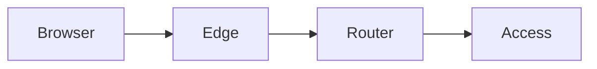

<style>
.lab-badge {
    display: inline-block;
    padding: 4px 10px;
    border-radius: 999px;
    background: #eef2ff;
    color: #3730a3;
    font-weight: 600;
    font-size: 0.9em;
}
.mermaid-fit {
  transform: scale(0.7);
  transform-origin: top center;
}
</style>

# Better Auth в Next.js

### Лекция 3  
Middleware-инфраструктура и production security

---

# Цель лекции

Превратить работающую модель session  
в production-ready security-конфигурацию  
с использованием middleware и корректных cookie-политик.

---

# Работает ≠ Безопасно

У нас уже есть:

- session
- protectedProcedure
- RBAC
- ownership

Но:

- cookie могут быть уязвимы
- session может быть перехвачена
- CSRF может обойти защиту

---

# Production security — это

- корректные cookie-параметры
- контроль времени жизни session
- rotation
- CSRF-защита
- централизованная middleware-проверка

---

# Cookie как поверхность атаки

Cookie:

- автоматически отправляется
- хранит sessionId
- участвует в каждом запросе

Ошибочная конфигурация = уязвимость.

---

# HttpOnly cookie

<span class="lab-badge">🧪 bauth21</span>

Защита от XSS-чтения cookie.

```ts
setCookie("session", sessionId, {
  httpOnly: true,
})
```

Без HttpOnly JS может прочитать sessionId.

---

# Secure cookie

<span class="lab-badge">🧪 bauth22</span>

Cookie передаётся только по HTTPS.

```ts
setCookie("session", sessionId, {
  httpOnly: true,
  secure: process.env.NODE_ENV === "production",
})
```

---

# SameSite политика

<span class="lab-badge">🧪 bauth23</span>

Базовая защита от CSRF.

```ts
setCookie("session", sessionId, {
  sameSite: "lax",
})
```

---

# Cookie-параметры вместе

```ts
setCookie("session", sessionId, {
  httpOnly: true,
  secure: process.env.NODE_ENV === "production",
  sameSite: "lax",
})
```

---

# Absolute expiration

<span class="lab-badge">🧪 bauth24</span>

Фиксированное время жизни session.

```ts
const expiresAt = new Date(Date.now() + 60 * 60 * 1000)

await createSession({
  userId,
  expiresAt,
})
```

---

# Проверка абсолютного истечения

```ts
if (session.expiresAt < new Date()) {
  throw new TRPCError({ code: "UNAUTHORIZED" })
}
```

---

# Sliding expiration

<span class="lab-badge">🧪 bauth25</span>

Продление срока действия при активности.

```ts
await updateSession(session.id, {
  expiresAt: new Date(Date.now() + 60 * 60 * 1000),
})
```

---

# Absolute vs Sliding

Absolute:

- фиксированное время

Sliding:

- продлевается при активности

Production-системы часто используют комбинацию.

---

# Session rotation

<span class="lab-badge">🧪 bauth26</span>

Создание новой session при повторной аутентификации.

```ts
await deleteSession(oldSessionId)

const newSession = await createSession({
  userId,
  expiresAt,
})
```

---

# Почему rotation важна

- снижает риск фиксации сессии
- обновляет идентификатор
- повышает устойчивость

---

# Почему SameSite недостаточно

CSRF возможен:

- через form submission
- через cross-site POST

Нужна дополнительная проверка.

---

# Double Submit CSRF

Идея:

1. Сервер устанавливает csrfToken cookie
2. Клиент отправляет токен в заголовке
3. Сервер сравнивает значения

---

# Генерация CSRF-токена

<span class="lab-badge">🧪 bauth27</span>

```ts
const csrfToken = crypto.randomUUID()

setCookie("csrf", csrfToken, {
  sameSite: "lax",
})
```

---

# Проверка CSRF в mutation

```ts
if (req.headers["x-csrf-token"] !== req.cookies.csrf) {
  throw new TRPCError({ code: "FORBIDDEN" })
}
```

---

# Middleware для CSRF

```ts
export const csrfMiddleware = t.middleware(
  async ({ ctx, next }) => {
    const header = ctx.req.headers["x-csrf-token"]
    const cookie = ctx.req.cookies.csrf

    if (header !== cookie) {
      throw new TRPCError({ code: "FORBIDDEN" })
    }

    return next()
  }
)
```

---

# Где применять CSRF?

- только для mutation
- не для query
- централизованно через middleware

---

# Middleware Next.js vs tRPC

<span class="lab-badge">🧪 bauth28</span>

Next.js middleware:

- edge-level
- до API

tRPC middleware:

- на уровне процедур

---

# Разделение ответственности



Edge:

- базовые проверки

Router:

- авторизация

---

# Отсутствующий cookie

<span class="lab-badge">🧪 bauth29</span>

Если cookie нет:

```ts
if (!sessionId) {
  throw new TRPCError({ code: "UNAUTHORIZED" })
}
```

---

# Негативный сценарий

- пользователь удалил cookie
- истёк срок действия
- cookie не отправлен

Система должна корректно отказать.

---

# Production-ready конфигурация

<span class="lab-badge">🧪 bauth30</span>

```ts
const isProd = process.env.NODE_ENV === "production"

setCookie("session", sessionId, {
  httpOnly: true,
  secure: isProd,
  sameSite: "lax",
})
```

---

# Полная security-модель

- HttpOnly
- Secure
- SameSite
- Absolute expiration
- Sliding expiration
- Rotation
- CSRF middleware

---

# Архитектурный инвариант

Security:

- централизована
- декларативна
- не дублируется
- не смешивается с бизнес-логикой

---

# Что должно быть понятно

Вы должны понимать:

- как настроить cookie безопасно
- как управлять временем жизни session
- зачем нужна rotation
- как реализуется CSRF
- где размещать middleware

---

# Summary

Production security:

- начинается с cookie
- продолжается expiration
- усиливается rotation
- защищается CSRF
- централизуется через middleware
```
