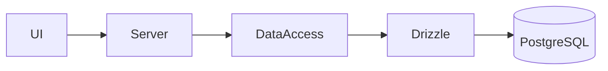
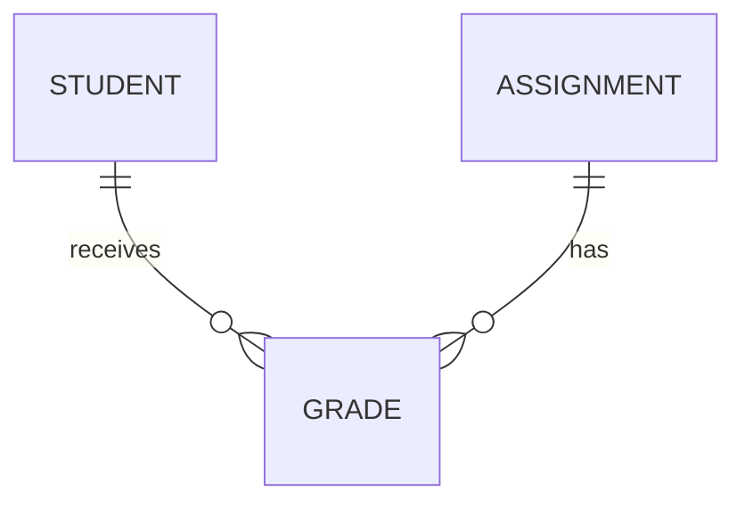

# Drizzle ORM: философия и schema-first подход

---

## Цель лекции

- Понять место Drizzle ORM в архитектуре
- Освоить SQL-first и schema-first подход
- Научиться описывать таблицы и ограничения
- Реализовать primary key и foreign key
- Подготовиться к лабораторной работе

---

## ORM как слой доступа к данным

ORM — слой между серверной логикой и базой данных.

Он:

- описывает структуру данных
- формализует ограничения
- управляет SQL-запросами
- обеспечивает типобезопасность

---

## Где находится Drizzle



Drizzle — инфраструктурный слой.  
Он делает SQL типобезопасным, но не скрывает его.

---

## SQL-first и schema-first

SQL-first:

- мышление в терминах SELECT / INSERT / JOIN
- отсутствие скрытых абстракций

Schema-first:

- сначала описывается структура БД
- схема — источник истины
- типы выводятся из схемы
- SQL генерируется из TypeScript

---

## Учебный кейс

<div style="display: grid; grid-template-columns: 1fr 1fr; gap: 24px; align-items: center;">

<div>

Сущности:

- Student  
- Assignment  
- Grade  

Связь many-to-many.  
Grade связывает одного студента и одно задание.

</div>

<div>



</div>

</div>


---

## Базовое описание таблицы (drizzle01)

```ts
export const students = pgTable("students", {
  id: serial("id"),
  name: text("name"),
  email: text("email"),
});
```

SQL-смысл:

```sql
CREATE TABLE students (
  id SERIAL,
  name TEXT,
  email TEXT
);
```

Это декларативное описание структуры таблицы.

---

## NOT NULL и PRIMARY KEY (drizzle02–drizzle04)

<div style="display: grid; grid-template-columns: 1fr 1fr; gap: 32px; align-items: start;">

<div>

```ts
export const students = pgTable("students", {
  id: serial("id").primaryKey(),
  name: text("name").notNull(),
  email: text("email").notNull(),
});
```

```sql
id SERIAL PRIMARY KEY,
name TEXT NOT NULL,
email TEXT NOT NULL
```

</div>

<div>

**PRIMARY KEY**

- уникален  
- not null  
- идентифицирует строку  
- используется в связях  

**NOT NULL**

- запрещает отсутствие значения  
- фиксирует обязательность  
- предотвращает некорректные данные  

</div>

</div>

---

## UNIQUE (drizzle03)

```ts
export const students = pgTable("students", {
  id: serial("id").primaryKey(),
  name: text("name").notNull(),
  email: text("email").notNull(),
});

export const studentsEmailIndex =
  uniqueIndex("students_email_unique")
    .on(students.email);
```

SQL:

```sql
CREATE UNIQUE INDEX students_email_unique
ON students(email);
```

UNIQUE предотвращает дублирование данных.

---

## Таблица Assignment

```ts
export const assignments = pgTable("assignments", {
  id: serial("id").primaryKey(),
  title: text("title").notNull(),
  maxScore: integer("max_score").notNull(),
});
```

- primary key
- обязательные поля
- контроль структуры

---

## FOREIGN KEY (drizzle05)

```ts
export const grades = pgTable("grades", {
  id: serial("id").primaryKey(),
  studentId: integer("student_id")
    .notNull()
    .references(() => students.id),
  assignmentId: integer("assignment_id")
    .notNull()
    .references(() => assignments.id),
  score: integer("score").notNull(),
});
```

---

## SQL-смысл FOREIGN KEY

```sql
FOREIGN KEY (student_id) REFERENCES students(id),
FOREIGN KEY (assignment_id) REFERENCES assignments(id)
```

FOREIGN KEY:

- запрещает ссылку на несуществующую запись
- обеспечивает ссылочную целостность
- формирует реляционную модель

---

## Типизация из схемы

```ts
export const students = pgTable("students", {
  id: serial("id").primaryKey(),
  name: text("name").notNull(),
  email: text("email").notNull(),
});
```

Insert-модель:

- id можно не передавать
- обязательные поля контролируются

Select-модель:

- структура результата соответствует схеме
- nullable учитывается

---

## drizzle-kit и применение схемы

```text
schema.ts
   ↓
drizzle-kit generate
   ↓
migration.sql
   ↓
PostgreSQL
```

drizzle-kit:

- генерирует SQL
- создаёт миграции
- применяет изменения

Schema-first означает:  
TypeScript → SQL → БД.

---

## Базовые запросы

```ts
await db.insert(students).values({
  name: "Alice",
  email: "alice@example.com",
});

const list = await db.select().from(students);
```

Соответствует:

```sql
INSERT INTO students (name, email) VALUES (...);
SELECT * FROM students;
```

---

## Лабораторная работа (краткий обзор)

В лабораторной требуется:

- описать таблицы через pgTable
- задать NOT NULL
- задать UNIQUE
- задать PRIMARY KEY
- реализовать FOREIGN KEY
- применить схему к базе
- выполнить базовый insert и select

Все необходимые конструкции разобраны в лекции.

---

# Итог

После лекции вы:

- понимаете SQL-first подход
- умеете описывать таблицы
- задаёте ограничения целостности
- реализуете primary key и foreign key
- понимаете связь TypeScript-схемы и SQL

Следующая лекция — CRUD и фильтрация.
