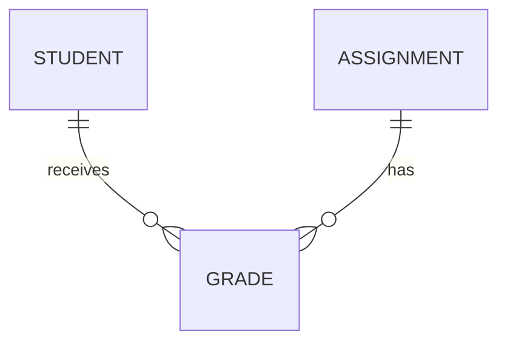

<style>
.lab-badge {
    display: inline-block;
    padding: 4px 10px;
    border-radius: 999px;
    background: #eef2ff;
    color: #3730a3;
    font-weight: 600;
    font-size: 0.9em;
}
.mermaid-fit {
  transform: scale(0.7);
  transform-origin: top center;
}
</style>

# Drizzle ORM: JOIN, связи и транзакции

---

## Цель лекции

- Понять реляционные связи
- Освоить JOIN в Drizzle
- Реализовать many-to-many
- Использовать агрегаты по связанным данным
- Освоить транзакции
- Подготовиться к лабораторной работе

---

## Связанные данные в реляционной модели

Реляционная БД хранит:

- сущности в отдельных таблицах
- связи через ключи

Связи обеспечивают:

- нормализацию данных
- отсутствие дублирования
- логическую целостность

---

## Типы связей

- one-to-one  
- one-to-many  
- many-to-many  

В нашем кейсе:

Student ↔ Assignment  
many-to-many через Grade

---

## Логическая модель



Grade — промежуточная таблица.

---

## INNER JOIN

<span class="lab-badge">🧪 drizzle16</span>

```ts
const result = await db
  .select()
  .from(students)
  .innerJoin(
    grades,
    eq(students.id, grades.studentId)
  );
```

SQL (INNER JOIN возвращает только совпадающие строки): 

```sql
SELECT *
FROM students
INNER JOIN grades
ON students.id = grades.student_id;
```


---

## LEFT JOIN

<span class="lab-badge">🧪 drizzle17</span>

```ts
const result = await db
  .select()
  .from(students)
  .leftJoin(
    grades,
    eq(students.id, grades.studentId)
  );
```

SQL (LEFT JOIN сохраняет строки левой таблицы):

```sql
SELECT *
FROM students
LEFT JOIN grades
ON students.id = grades.student_id;
```


---

## JOIN + WHERE

<span class="lab-badge">🧪 drizzle18</span>

```ts
const result = await db
  .select()
  .from(students)
  .innerJoin(
    grades,
    eq(students.id, grades.studentId)
  )
  .where(eq(grades.score, 100));
```

SQL (JOIN можно комбинировать с фильтрацией):

```sql
SELECT *
FROM students
INNER JOIN grades
ON students.id = grades.student_id
WHERE grades.score = 100;
```


---

## Проекция из нескольких таблиц

<span class="lab-badge">🧪 drizzle19</span>

```ts
const result = await db
  .select({
    studentName: students.name,
    score: grades.score,
  })
  .from(students)
  .innerJoin(
    grades,
    eq(students.id, grades.studentId)
  );
```

Позволяет контролировать структуру результата.

---

## Many-to-many

<span class="lab-badge">🧪 drizzle20</span>

<div style="display: grid; grid-template-columns: 1fr 1fr; gap: 32px; align-items: start;">

<div>

```ts
const result = await db
  .select({
    studentName: students.name,
    assignmentTitle: assignments.title,
  })
  .from(students)
  .innerJoin(
    grades,
    eq(students.id, grades.studentId)
  )
  .innerJoin(
    assignments,
    eq(grades.assignmentId, assignments.id)
  );
```

</div>

<div>

```sql
SELECT students.name, assignments.title
FROM students
JOIN grades
  ON students.id = grades.student_id
JOIN assignments
  ON grades.assignment_id = assignments.id;
```

- связь many-to-many
- промежуточная таблица Grade
- цепочка JOIN

</div>

</div>


---

## GROUP BY

<span class="lab-badge">🧪 drizzle22</span>

```ts
const result = await db
  .select({
    studentId: students.id,
    totalGrades: count(grades.id),
  })
  .from(students)
  .leftJoin(
    grades,
    eq(students.id, grades.studentId)
  )
  .groupBy(students.id);
```

SQL (GROUP BY структурирует агрегированные данные):

```sql
GROUP BY students.id;
```


---

## Сортировка по агрегату

<span class="lab-badge">🧪 drizzle23</span>

```ts
const result = await db
  .select({
    studentId: students.id,
    totalGrades: count(grades.id),
  })
  .from(students)
  .leftJoin(
    grades,
    eq(students.id, grades.studentId)
  )
  .groupBy(students.id)
  .orderBy(desc(count(grades.id)));
```

Позволяет упорядочить по вычисленному значению.

---

## Транзакция

<span class="lab-badge">🧪 drizzle24</span>

```ts
await db.transaction(async (tx) => {
  await tx.insert(students).values({
    name: "Alice",
    email: "alice@example.com",
  });

  await tx.insert(grades).values({
    studentId: 1,
    assignmentId: 1,
    score: 100,
  });
});
```

Транзакция объединяет операции в атомарный блок.

---

## Rollback при ошибке

<span class="lab-badge">🧪 drizzle25</span>

```ts
await db.transaction(async (tx) => {
  await tx.insert(students).values({
    name: "Alice",
    email: "alice@example.com",
  });

  throw new Error("Ошибка");

  await tx.insert(grades).values({
    studentId: 1,
    assignmentId: 1,
    score: 100,
  });
});
```

При выбросе ошибки происходит rollback.

---

## Что гарантирует транзакция

- атомарность
- согласованность данных
- отсутствие частично выполненных операций
- целостность состояния

Транзакции критичны при связанных изменениях.

---

## Лабораторная работа (краткий обзор)

В лабораторной требуется:

- реализовать innerJoin
- реализовать leftJoin
- комбинировать join и where
- реализовать many-to-many
- использовать агрегаты с join
- применить groupBy
- сортировать по агрегату
- реализовать транзакцию
- обеспечить rollback при ошибке

Все необходимые конструкции разобраны в лекции.

---

# Итог

После лекции вы:

- понимаете типы связей
- умеете писать JOIN
- реализуете many-to-many
- используете агрегаты с groupBy
- понимаете транзакции
- умеете обеспечивать целостность данных

Следующая лекция — интеграция Drizzle в Next.js.
