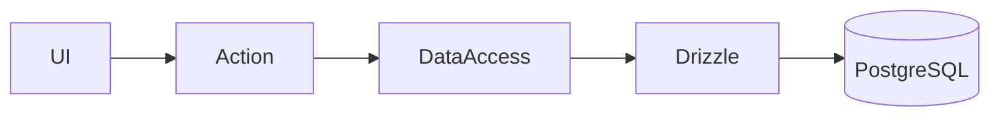
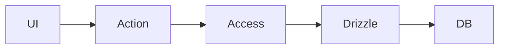

# Drizzle ORM в архитектуре Next.js

---

## Цель лекции

- Понять границу server / client
- Организовать подключение к БД
- Выделить data-access слой
- Использовать Server Actions
- Обрабатывать ошибки
- Построить полный data-flow
- Подготовиться к лабораторной работе

---

## Drizzle в Next.js: server-only

Операции с БД:

- выполняются только на сервере
- не доступны клиентскому коду
- не должны попадать в browser bundle

---

## Server-only функция (drizzle26)

```ts
"use server";

export async function getStudents() {
  return db.select().from(students);
}
```

- доступна только серверу
- не может быть вызвана напрямую из клиента
- защищает слой данных

---

## Singleton подключения (drizzle27)

```ts
let _db: ReturnType<typeof drizzle> | undefined;

export function getDb() {
  if (!_db) {
    _db = drizzle(process.env.DATABASE_URL!);
  }
  return _db;
}
```

Зачем:

- одно подключение
- контроль ресурсов
- отсутствие повторной инициализации

---

## Архитектура слоя доступа



Разделение ответственности:

- UI — представление
- Action — orchestration
- DataAccess — SQL
- Drizzle — ORM

---

## Data-access функция (drizzle28)

```ts
export async function getStudentById(id: number) {
  return db
    .select()
    .from(students)
    .where(eq(students.id, id));
}
```

- инкапсулирует запрос
- принимает параметры
- возвращает типизированный результат

---

## Server Action поверх data-access (drizzle29)

```ts
"use server";

export async function getStudentView(id: number) {
  const result = await getStudentById(id);
  return result?.[0] ?? null;
}
```

Server Action:

- вызывает data-access
- трансформирует результат
- не содержит SQL

---

## Server Component loader (drizzle30)

```ts
export default async function Page() {
  const studentsList = await getStudents();

  if (!studentsList.length) {
    return <div>Нет данных</div>;
  }

  return <div>{studentsList.length}</div>;
}
```

- асинхронная загрузка
- проверка пустого результата
- устойчивое поведение

---

## Обработка отсутствующих данных (drizzle31)

```ts
export async function getStudentOrNull(id: number) {
  const result = await getStudentById(id);
  return result[0] ?? null;
}
```

SELECT может вернуть пустой массив.  
Это нужно обрабатывать явно.

---

## Обработка ошибки БД (drizzle32)

```ts
export async function createStudent(data: InsertStudent) {
  try {
    return await db.insert(students).values(data);
  } catch (error) {
    throw new Error("Ошибка сохранения");
  }
}
```

- перехват ошибки
- трансформация ошибки
- централизованный контроль

---

## Runtime-проверка server-only (drizzle33)

```ts
if (typeof window !== "undefined") {
  throw new Error("Database access is server-only");
}
```

Защита от некорректного окружения.

---

## Повторное использование data-access (drizzle34)

```ts
export async function getStudentNames() {
  const studentsList = await getStudents();
  return studentsList.map(s => s.name);
}
```

- повторное использование запроса
- трансформация без дублирования SQL

---

## Полный data-flow (drizzle35)



Цепочка:

- UI вызывает Action  
- Action вызывает data-access  
- data-access формирует SQL  
- Drizzle выполняет запрос  

---

## Производительность и подключения

- в dev возможна повторная инициализация
- singleton снижает нагрузку
- в serverless требуется контроль подключений
- нельзя создавать соединение на каждый вызов

---

## Безопасность

Drizzle:

- использует параметризованные запросы
- защищает от SQL injection
- не позволяет интерполяцию строк

Server-only:

- предотвращает утечку доступа к БД

---

## Лабораторная работа (краткий обзор)

В лабораторной требуется:

- реализовать server-only функцию
- создать singleton подключения
- выделить data-access слой
- реализовать Server Action
- обработать отсутствие данных
- обработать ошибку БД
- переиспользовать слой доступа
- построить полный data-flow

Все необходимые конструкции разобраны в лекции.

---

# Итог

После лекции вы:

- понимаете границу server / client
- умеете организовать подключение
- выделяете data-access слой
- реализуете Server Actions
- корректно обрабатываете ошибки
- понимаете полный поток данных

Курс завершён: вы освоили Drizzle как SQL-first ORM в архитектуре Next.js.
