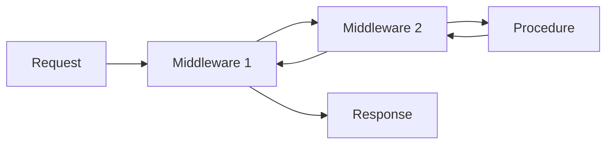

<style>
.lab-badge {
    display: inline-block;
    padding: 4px 10px;
    border-radius: 999px;
    background: #eef2ff;
    color: #3730a3;
    font-weight: 600;
    font-size: 0.9em;
}
.mermaid-fit {
  transform: scale(0.7);
  transform-origin: top center;
}
</style>

# tRPC в Next.js — Middleware, context и расширяемость API

---

# Цель лекции

- Понять API как расширяемую архитектурную границу
- Освоить middleware как механизм композиции
- Разделить доменные и API-ошибки
- Научиться расширять context безопасно
- Подготовиться к задачам trpc21–trpc30

---

# От CRUD к расширяемости

Лекция 2:

- API как orchestration-слой

Лекция 3:

- API как инфраструктурный конвейер
- Поведение добавляется без изменения процедур
- Cross-cutting логика вне бизнес-кода

---

# Context как инфраструктурный контейнер

Context может содержать:

- requestId
- logger
- auditService
- user
- role

Это не бизнес-логика.

Это инфраструктура запроса.

---

# Metadata из context

<span class="lab-badge">🧪 trpc21</span>

```ts
getRequestId: publicProcedure
  .query(({ ctx }) => {
    if (!ctx.requestId) {
      throw new TRPCError({ code: 'INTERNAL_SERVER_ERROR' })
    }

    return ctx.requestId
  })
```

Procedure использует инфраструктурные данные.

---

# Middleware — идея

Middleware:

- оборачивает procedure
- выполняется до и после
- не изменяет бизнес-логику напрямую

Procedure остаётся чистой.

---

# Модель выполнения middleware



Стековая модель.

---

# Базовый middleware

```ts
const timingMiddleware = t.middleware(async (opts) => {
  const start = Date.now()

  const result = await opts.next()

  const duration = Date.now() - start
  opts.ctx.logger.info(duration)

  return result
})
```

Procedure не знает о логировании.

---

# Структура result (кратко)

```ts
const result = await opts.next()

if (result.ok) {
  result.data
} else {
  result.error
}
```

Middleware может анализировать результат.

---

# Timing middleware

<span class="lab-badge">🧪 trpc22</span>

Измеряет время.

Не меняет контракт.

Добавляет observability.

---

# Audit middleware

<span class="lab-badge">🧪 trpc23</span>

```ts
const auditMiddleware = t.middleware(async (opts) => {
  const result = await opts.next()

  await opts.ctx.auditService.record({
    path: opts.path,
    data: result.ok ? result.data : null
  })

  return result
})
```

API расширяется без изменения процедур.

---

# Response shaping

<span class="lab-badge">🧪 trpc24</span>

Middleware может трансформировать ответ.

```ts
const responseWrapper = t.middleware(async (opts) => {
  const result = await opts.next()

  if (!result.ok) return result

  return {
    ...result,
    data: {
      requestId: opts.ctx.requestId,
      payload: result.data
    }
  }
})
```

Контракт модифицируется централизованно.

---

# protectedProcedure как композиция

```ts
const protectedProcedure =
  publicProcedure.use(authMiddleware)
```

Политика доступа вынесена из процедур.

---

# Role-based доступ

<span class="lab-badge">🧪 trpc25</span>

```ts
const adminProcedure =
  protectedProcedure.use(roleMiddleware('ADMIN'))
```

RBAC реализуется композиционно.

---

# Ошибки: три уровня

<div style="display:flex; gap:40px;">

<div style="flex:1;">

### Доменная ошибка

- EntityNotFoundError
- бизнес-смысл

</div>

<div style="flex:1;">

### API-ошибка

- TRPCError
- NOT_FOUND
- BAD_REQUEST

</div>

</div>

Инфраструктура ≠ домен.

---

# Error factory

<span class="lab-badge">🧪 trpc26</span>

```ts
function createNotFoundError(entity: string) {
  return new TRPCError({
    code: 'NOT_FOUND',
    message: `${entity} not found`
  })
}
```

Стандартизация API-ошибок.

---

# Нормализация доменной ошибки

<span class="lab-badge">🧪 trpc27</span>

```ts
try {
  return await ctx.userAccess.findById(id)
} catch (e) {
  if (e instanceof EntityNotFoundError) {
    throw createNotFoundError('User')
  }
  throw e
}
```

Домен и API разделены.

---

# Deterministic logging

<span class="lab-badge">🧪 trpc28</span>

```ts
const loggingMiddleware = t.middleware(async (opts) => {
  const result = await opts.next()

  if (result.ok && result.data === 'ok') {
    opts.ctx.logger.info('ok')
  } else {
    opts.ctx.logger.error('error')
  }

  return result
})
```

Поведение зависит от результата.

---

# Порядок middleware

<span class="lab-badge">🧪 trpc29</span>

```ts
procedure
  .use(prefixMiddleware)
  .use(suffixMiddleware)
```

Порядок влияет на результат.

Композиция не коммутативна.

---

# Расширение context

<span class="lab-badge">🧪 trpc30</span>

```ts
const requestIdMiddleware = t.middleware(async (opts) => {
  return opts.next({
    ctx: {
      ...opts.ctx,
      requestId: generateId()
    }
  })
})
```

Context расширяется безопасно.

---

# Принципы расширяемого API

- Процедуры — чистые
- Cross-cutting логика — в middleware
- Ошибки стандартизированы
- Context — единственный канал зависимостей
- Композиция важнее наследования

---

# Анти-паттерны

❌ Логирование внутри каждой процедуры  
❌ Авторизация через if в бизнес-коде  
❌ Смешивание доменной и API-ошибки  
❌ Глобальные singletons вместо ctx  

---

# Связь с лабораторными (trpc21–trpc30)

Вы реализуете:

1. Metadata из context  
2. Timing middleware  
3. Audit middleware  
4. Response shaping  
5. Role-based procedure  
6. Error factory  
7. Нормализацию ошибок  
8. Deterministic logging  
9. Порядок middleware  
10. Расширение context  

Лекция объясняет архитектурную модель.  
Практика проверяет корректность композиции.

---

# Итог

Middleware делает API:

- расширяемым
- композиционным
- архитектурно чистым

Context делает API:

- управляемым
- тестируемым
- независимым от инфраструктуры

tRPC — это не просто RPC.

Это архитектурная граница системы.
