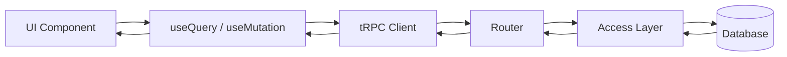

<style>
.lab-badge {
    display: inline-block;
    padding: 4px 10px;
    border-radius: 999px;
    background: #eef2ff;
    color: #3730a3;
    font-weight: 600;
    font-size: 0.9em;
}
.mermaid-fit {
  transform: scale(0.7);
  transform-origin: top center;
}
</style>

# tRPC в Next.js — Клиентский слой и архитектурная целостность

---

# Цель лекции

- Понять, как router порождает типизированные hooks
- Освоить useQuery и useMutation
- Разобраться с cache и invalidate
- Построить архитектуру клиентского слоя
- Сформировать целостную модель client data-flow

---

# От API к клиентскому data-flow

Лекции 1–3:

- контракт
- CRUD
- middleware
- архитектура API

Лекция 4:

- как клиент работает с этим контрактом
- как данные синхронизируются

---

# Router как источник hooks

Router:

- определяет namespace
- определяет input/output
- определяет типизацию

Client автоматически получает типизированные hooks.

Контракт не дублируется.

---

# Первый useQuery

<span class="lab-badge">🧪 trpc31</span>

```ts
const { data, isLoading } =
  trpc.user.getById.useQuery({
    id: '1'
  })
```

- тип input проверяется
- тип data выводится автоматически

End-to-end типизация.

---

# useQuery — что происходит

- формируется query key
- выполняется запрос
- результат кэшируется
- повторный вызов берёт данные из cache

React Query управляет состоянием.

---

# useQuery с input

<span class="lab-badge">🧪 trpc32</span>

Input — часть ключа кэша.

```ts
trpc.post.getById.useQuery({
  id: '42'
})
```

Разные input → разные cache-записи.

---

# useMutation — изменение состояния

Mutation:

- не кэшируется как query
- инициирует side-effect
- требует синхронизации cache

---

# Первый useMutation

<span class="lab-badge">🧪 trpc33</span>

```ts
const mutation =
  trpc.user.create.useMutation()

mutation.mutate({
  name: 'Alice'
})
```

Mutation не обновляет query автоматически.

---

# Проблема синхронизации

После mutation:

- сервер обновлён
- кэш может быть устаревшим

Нужна инвалидация.

---

# invalidate

<span class="lab-badge">🧪 trpc34</span>

```ts
const utils = trpc.useUtils()

mutation.mutate(input, {
  onSuccess: () => {
    utils.user.getById.invalidate({ id })
  }
})
```

Invalidate → повторный запрос → синхронизация UI.

---

# onSuccess — архитектурная роль

onSuccess:

- инкапсулирует post-mutation поведение
- не смешивает UI и инфраструктуру
- контролирует data-flow

---

# onSuccess

<span class="lab-badge">🧪 trpc35</span>

```ts
trpc.user.update.useMutation({
  onSuccess: () => {
    utils.user.getById.invalidate()
  }
})
```

Mutation управляет реакцией системы.

---

# onError

<span class="lab-badge">🧪 trpc36</span>

```ts
trpc.user.create.useMutation({
  onError: (error) => {
    console.error(error.message)
  }
})
```

Ошибка обрабатывается на клиенте.

API остаётся неизменным.

---

# Архитектура hooks по доменам

Плохо:

- все вызовы в одном файле
- хаотичный импорт

Хорошо:

- userHooks
- postHooks
- доменная изоляция

---

# Разделение hooks

<span class="lab-badge">🧪 trpc37</span>

```ts
export const userHooks = {
  useGetById: () =>
    trpc.user.getById.useQuery(),
}
```

Клиентский слой структурируется.

---

# Композиция hooks

<span class="lab-badge">🧪 trpc38</span>

```ts
export const api = {
  user: userHooks,
  post: postHooks
}
```

Повторяем структуру router.

Архитектурная симметрия.

---

# Централизованный экспорт

<span class="lab-badge">🧪 trpc39</span>

```ts
export * from './userHooks'
export * from './postHooks'
```

Единая точка входа.

Упрощение импорта.

---

# Полный client data-flow



Типизация проходит через все уровни.

---

# Полный цикл

<span class="lab-badge">🧪 trpc40</span>

1. useQuery загружает данные  
2. useMutation изменяет состояние  
3. onSuccess вызывает invalidate  
4. query перезапрашивается  
5. UI обновляется  

Это замкнутый цикл.

---

# Архитектурные принципы клиентского слоя

- Контракт определяется router
- Hooks повторяют доменную структуру
- Инвалидация — часть data-flow
- UI не знает о реализации API
- Ошибки обрабатываются локально

---

# Анти-паттерны

❌ Прямой fetch вместо tRPC  
❌ Дублирование типов  
❌ Глобальный invalidate без scope  
❌ Бизнес-логика в onSuccess  
❌ Несогласованная структура hooks  

---

# Связь с лабораторными (trpc31–trpc40)

Вы реализуете:

1. useQuery  
2. useQuery с input  
3. useMutation  
4. invalidate  
5. onSuccess  
6. onError  
7. Разделение hooks  
8. Композицию  
9. Централизованный экспорт  
10. Полный client data-flow  

Лекция объясняет архитектуру.  
Практика закрепляет синхронизацию данных.

---

# Итог

Клиентский слой:

- типобезопасен
- симметричен router
- управляет кэшем
- композиционно организован
- замыкает полный data-flow системы

tRPC связывает сервер и клиент в единый типизированный контур.
