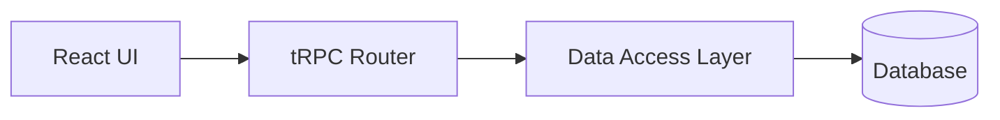
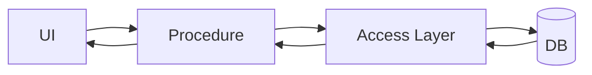

<style>
.lab-badge {
    display: inline-block;
    padding: 4px 10px;
    border-radius: 999px;
    background: #eef2ff;
    color: #3730a3;
    font-weight: 600;
    font-size: 0.9em;
}
.mermaid-fit {
  transform: scale(0.7);
  transform-origin: top center;
}
</style>

# tRPC в Next.js — Минимальный tRPC API

---

# Цель лекции

- Понять RPC-модель
- Освоить базовые элементы tRPC
- Построить минимальный router
- Осознать принцип end-to-end типобезопасности
- Подготовиться к задачам trpc01–trpc10

---

# Проблема типобезопасности API

REST-контракт:

- URL
- HTTP-метод
- JSON
- DTO на клиенте
- DTO на сервере

Типы существуют отдельно.

TypeScript не контролирует границу HTTP.

---

# Где возникает рассинхронизация?

- сервер изменил структуру ответа
- клиент не обновил интерфейс
- runtime-ошибка вместо compile-time

Типизация разрывается на уровне сети.

---

# RPC-подход

RPC = вызов функции на сервере

Клиент видит:

- имя процедуры
- тип входа
- тип результата

API становится набором типизированных функций.

---

# Что делает tRPC

- не генерирует OpenAPI
- не требует DTO
- не требует схем маршрутов

Он использует TypeScript как источник контракта.

End-to-end type safety.

---

# Архитектура в Next.js

UI → tRPC → access layer → DB




---

# Инициализация tRPC

Базовая точка входа.

```ts
import { initTRPC } from '@trpc/server'

const t = initTRPC.create()

export const router = t.router
export const publicProcedure = t.procedure
```

router — фабрика API  
procedure — фабрика операций

---

# Минимальный router

<span class="lab-badge">🧪 trpc01</span>

Контракт приложения — это router.

```ts
export const appRouter = router({})

export type AppRouter = typeof appRouter
```

AppRouter — источник типов для клиента.

---

# Процедура (procedure)

procedure — типизированная функция API.

Два вида:

- query
- mutation

---

# Первая query

<span class="lab-badge">🧪 trpc02</span>

```ts
export const appRouter = router({
  hello: publicProcedure
    .query(() => 'hello')
})
```

query — операция чтения.

---

# Структурированный результат

<span class="lab-badge">🧪 trpc03</span>

Типизация распространяется на объект.

```ts
hello: publicProcedure
  .query(() => ({
    message: 'hello',
    version: 1
  }))
```

Клиент получит точную структуру.

---

# Входные данные (input)

RPC-процедура принимает аргументы.

Input — часть контракта.


## Input в query

<span class="lab-badge">🧪 trpc04</span>

```ts
hello: publicProcedure
  .input(z.object({
    name: z.string()
  }))
  .query(({ input }) => {
    return `Hello, ${input.name}`
  })
```

input типизируется автоматически.

---

# Декларативная валидация

<span class="lab-badge">🧪 trpc05</span>

zod выполняет:

- runtime-проверку
- формирование типов

```ts
.input(z.object({
  id: z.string().uuid()
}))
```

Схема = контракт + защита.

---

# query vs mutation

query  
- чтение  
- не меняет состояние  

mutation  
- изменение состояния  
- соответствует CRUD

---

# Первая mutation

<span class="lab-badge">🧪 trpc06</span>

```ts
createUser: publicProcedure
  .input(z.object({
    name: z.string()
  }))
  .mutation(async ({ input }) => {
    return { id: '1', name: input.name }
  })
```

mutation семантически обозначает изменение.

---

# Связь с data-access слоем

API не должен работать с БД напрямую.

Он вызывает access-функцию.

## Вызов access-слоя (Drizzle)

```ts
createUser: publicProcedure
  .input(userSchema)
  .mutation(async ({ input }) => {
    return createUserInDb(input)
  })
```

Router остаётся тонким.

Бизнес-логика — ниже.

---

# Context как DI-механизм

Context передаёт зависимости.

- access layer
- logger
- metadata запроса

Без глобальных импортов.

---

# Context

<span class="lab-badge">🧪 trpc07</span>

```ts
createUser: publicProcedure
  .mutation(async ({ ctx }) => {
    return ctx.userAccess.create()
  })
```

DI вместо прямых импортов.

---

# Middleware

Middleware расширяет поведение:

- логирование
- авторизация
- модификация результата

Не смешивается с бизнес-логикой.

---

# Базовый middleware

<span class="lab-badge">🧪 trpc08</span>

```ts
const loggerMiddleware = t.middleware(async (opts) => {
  console.log(opts.path)
  return opts.next()
})
```

Подключается к procedure.

---

# protectedProcedure

Композиция middleware.

Архитектурный паттерн защиты API.

---

# protectedProcedure

<span class="lab-badge">🧪 trpc09</span>

```ts
const protectedProcedure =
  publicProcedure.use(authMiddleware)
```

Повторное использование политики доступа.

---

# Композиция router

API масштабируется по доменам.

## Вложенные router

<span class="lab-badge">🧪 trpc10</span>

```ts
const userRouter = router({
  get: publicProcedure.query(...)
})

export const appRouter = router({
  user: userRouter
})
```

Namespace формируется автоматически.

---

# Полный data-flow



Типизация проходит через все уровни.

---

# Что важно понять

- Router = контракт приложения
- Procedure = типизированная операция
- zod = входная защита
- Context = DI
- Middleware = расширяемость
- tRPC = RPC, а не REST

---

# Связь с лабораторными (trpc01–trpc10)

Вы реализуете:

1. Router
2. Query
3. Структурированный ответ
4. Input
5. Валидацию
6. Mutation
7. Context
8. Middleware
9. protectedProcedure
10. Композицию router

Лекция объясняет концепции.  
Практика — закрепляет реализацию.

---

# Итог

tRPC:

- устраняет разрыв типов
- превращает API в набор функций
- делает TypeScript источником истины
- поддерживает DI и масштабируемость

Минимальный API — это уже архитектурный контракт.
